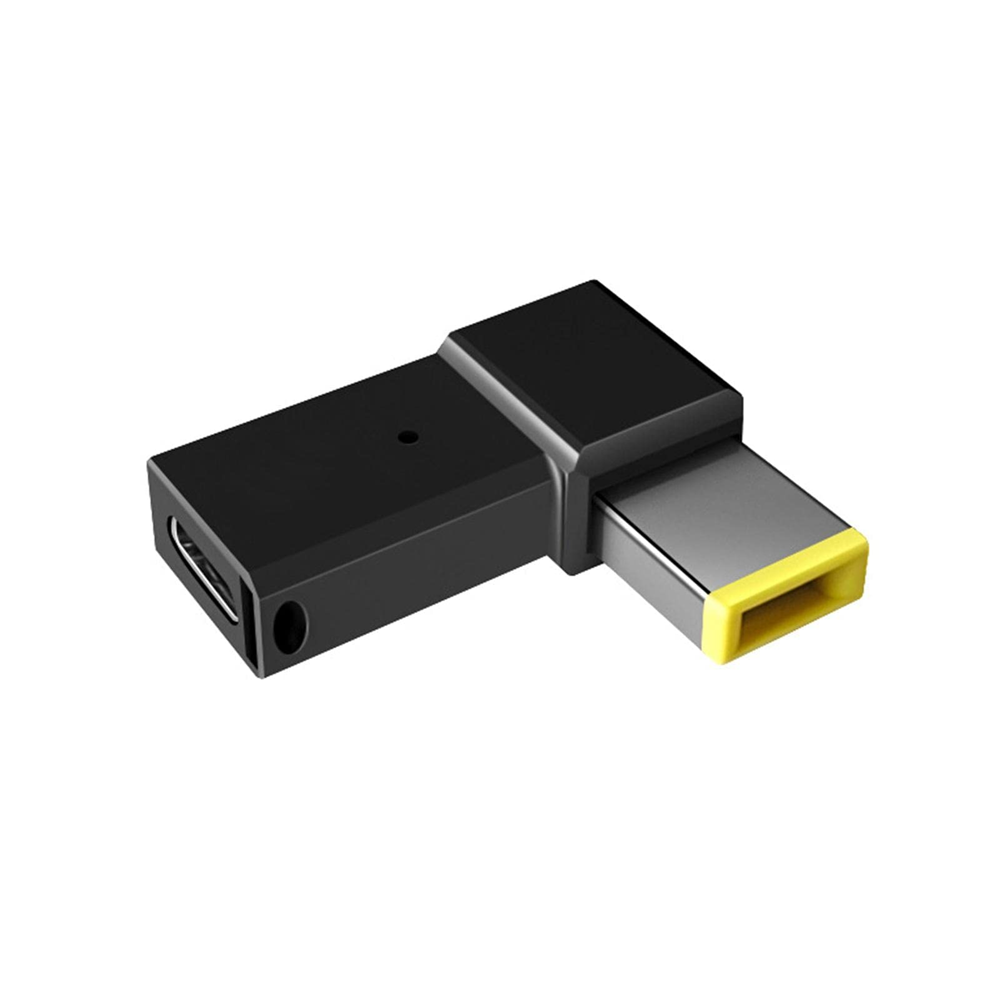

While some models of ThinkPad can charge by their USB-C port, there are many that can only be charged via the yellow rectangular power socket, referred to by Lenovo as "slim tip". 

The result being you may end up carrying two chargers around with you... a hefty ThinkPad brick with a mains plug and a compact USB-C charger for your other devices.

Recent advances in the [USB-C specification](https://www.usb.org/sites/default/files/2021-05/USB%20PG%20USB%20PD%203.1%20DevUpdate%20Announcement_FINAL.pdf) allow for higher power USB-C charging.

This means you can replace the bulky ThinkPad charger with a more versatile USB-C one and embrace a lighter charging solution.

<!--more-->

## Charger

Choose a high-quality GaN USB-C charger, which has at least 1 port capable of delivering the power your ThinkPad needs (for example, 135W, or more).  Ensure the charger's output matches or exceeds your laptop's power requirement.

## USB-C Cable

The chances are that those old USB-C cables languishing in the back of a drawer won't do the job.  Standard USB-C cables won't suffice, as they can't handle higher power.  Buy a USB-C cable rated for 240W, or at least for the power your ThinkPad requires.  These cables are typically thicker and more costly, but necessary.

> Unless the GaN charger detects the cable is capable of higher power, the charger will limit itself to only 60W and the ThinkPad will not charge.

> Tip:  Select a cable that also provides a high rate of data transfer, for example 40Gbps, so you can use it for power and then when the ThinkPad battery doesn't need charging... use the same cable for data and/or video.

The higher-spec cable is backwards compatible, so can be used with older USB-C devices.

## Slim Tip to USB-C Adapter

Opt for an adapter or a short cable (10cm), ensuring it is rated for your ThinkPad's power needs.  As with the cable, avoid low-rated options.

## Conclusion

By selecting the right charger, cable and adapter, you can streamline your ThinkPad's charging setup with USB-C, saving weight and space in your backpack.