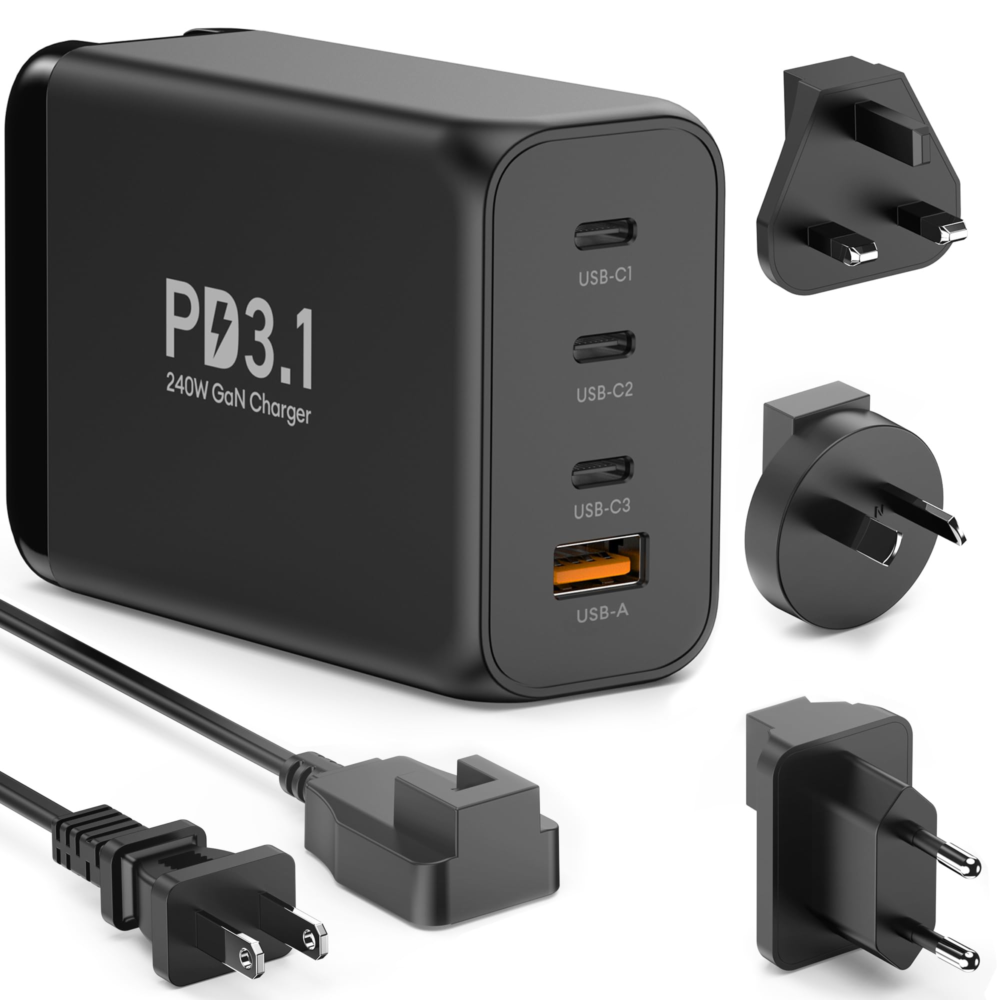
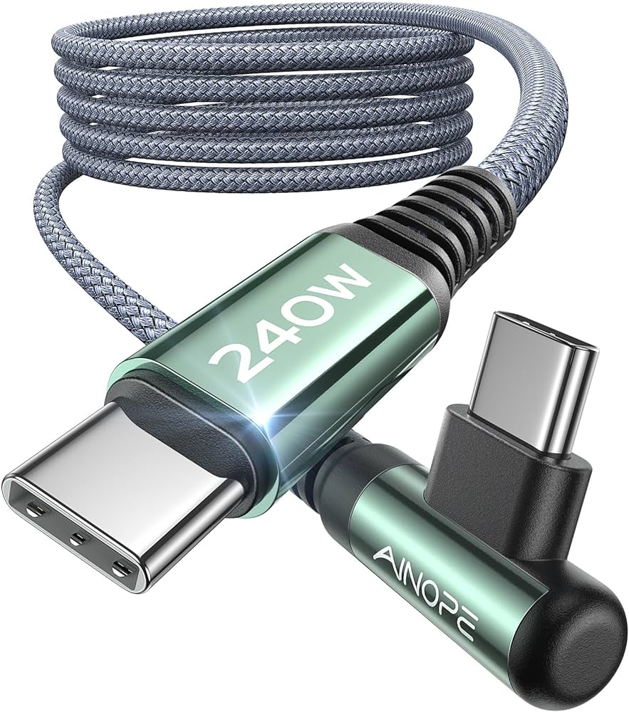

Many ThinkPads still use Lenovo's 'slim tip' charging port.  Recent advances allow for USB-C charging. This means you can  replace the bulky ThinkPad charger with a more versatile and compact USB-C one.

<!--more-->

## Embrace a Lighter Charging Solution

### The Charger

Choose a high-quality GaN USB-C charger, capable of delivering the power your ThinkPad needs (for example, 135W, or more).  Ensure the charger's output matches or exceeds your laptop's power requirement.

> Tip: For multi-port chargers, confirm at least one port supports the needed power output.

### The USB-C Cable

The chances are that those old USB-C cables languishing in the back of a drawer won't do the job.  Standard USB-C cables won't suffice, as they can't handle higher power.  Buy a USB-C cable rated for 240W, or at least for the power your ThinkPad requires.  These cables are typically thicker and more costly, but necessary.

> Unless the GaN charger detects the cable is capable of higher power, the charger will limit itself to only 60W and the ThinkPad will not charge, see [USB Promoter Group Announces USB Power Delivery Specification Revision 3.1](https://www.usb.org/sites/default/files/2021-05/USB%20PG%20USB%20PD%203.1%20DevUpdate%20Announcement_FINAL.pdf).

### The Slim Tip to USB-C Adapter

Opt for an adapter or a short cable, ensuring it is rated for your ThinkPad's power needs.  As with the cable, avoid low-rated options.

## Conclusion

By selecting the right charger, cable and adapter, you can streamline your ThinkPad's charging setup with USB-C, saving weight and space in your backpack.